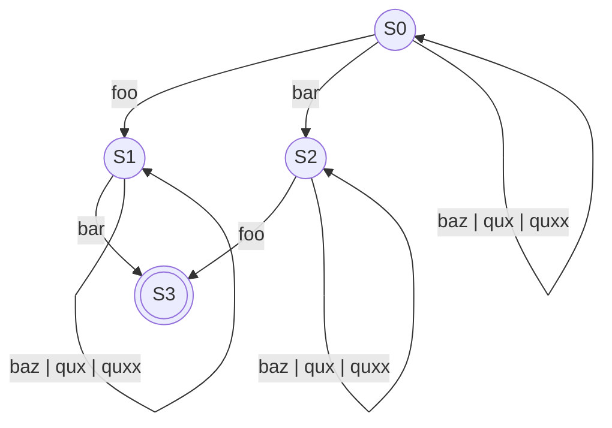

[](https://crates.io/crates/tidy_builder)
[](https://docs.rs/tidy-builder) 

The `Builder` macro derives a builder that is compile-time correct which means you cannot call the `build` function until you've 
provided a value for all *required* fields. From the perspective of the builder there are three types of fields:
- **Optional** fields that are wrapped in an `Option`.
- **Provided** fields that have a (lazy) value provided for them.
- **Required** fields which are neither optional nor provided.
Let's look at an example:
```rust
use tidy_builder::Builder;

fn get_quxx() -> usize {
    /* Do some computation */

    0
}

#[derive(Builder)]
struct MyStruct {
    foo: usize,
    bar: usize,
    baz: Option<usize>,
    #[builder(value = 0)]
    qux: usize,
    #[builder(lazy = get_quxx)]
    quxx: usize,
}

fn main() {
    let my_struct = MyStruct::builder().foo(0).bar(0).build();

    assert_eq!(my_struct.foo, 0);
    assert_eq!(my_struct.bar, 0);
    assert_eq!(my_struct.baz, None);
    assert_eq!(my_struct.qux, 0);
    assert_eq!(my_struct.quxx, 0);
}
````
in the code above, `foo` and `bar` are required, `baz` is optional, and both `qux` and `quxx` are provided fields. Note that you won't be able to call
the `build` function until you provide a value for both `foo` and `bar`. To guarantee this, the `Builder` macro creates a state machine and exposes the
`build` function only at the final state where all required fields are provided with a value. For example, the state machine of the `MyStruct` will be:


# Features
### Generics
Lifetimes, type parameters, const generics, where clauses, and parameter bounds are supported.

### Properties
Syntax: `#[builder(props = skip, hide, once, into)]` 
- Skip creating a setter for an optional or provided field: \
  `#[builder(props = skip)]`
- Make a setter private: \
  `#[builder(props = hide)]`
- Enforce that a required field is only set once: \
  `#[builder(props = once)]`
- Accept `impl Into` instead of the actual type of the field in the setter: \
  `#[builder(props = into)]`

### Rename The Setter
You can rename the setter of a field: \
`#[builder(name = setter_name)]`

### Validator
You can specify a validator to check whether the provided values for a field are valid or not: \
`#[builder(check = callable)]`

### Provide a Value
Syntax: \
`#[builder(value = default)]`, \
`#[builder(value = literal)]`, \
`#[builder(value = callable)]`
- Provide a value using the `Default` implementation of the field: `#[builder(value = default)]`
- Provide a value using a literal: `#[builder(value = 0)]`, `#[builder(value = false)]`
- Provide a value using a callable

*NOTE*: If you provide a value using an async callable, the `builder` function will be async. \
*NOTE*: If you provide a value and specify a validator, the `builder` function will return a `Result`.

### Repeated Setter
Syntax: \
`#[builder(each = setter_name)]`, \
`#[builder(each = setter_name, callable)]` \
You can ask the builder to generate a repeated setter for a field. A repeated setter appends the provided values to the field instead of
replacing its value. Also, you can specify a callable to check for the validity of the values. For example:
```rust
#[derive(tidy_builder::Builder)]
struct MyStruct {
    #[builder(each = arg, |num| num % 2 == 0)]
    args: Vec<usize>,
}

fn main() -> Result<(), Box<dyn std::error::Error>> {
    let my_struct = MyStruct::builder().arg(0)?.arg(2)?.build();

    assert_eq!(my_struct.args, vec![0, 2]);

    Ok(())
}
```
The collection on which the `each` attribute is applicable must have two properties:
- Have a `Default` implementation that returns an empty collection
- Implements the `Extend` trait.
`Vec` and `HashMap` are good exmaples.

### Lazy Value Provider
Syntax: \
`#[builder(lazy)]`, \
`#[builder(lazy = override)]`, \
`#[builder(lazy = async)]`, \
`#[builder(lazy = callable)]`, \
`#[builder(lazy = override, callable)]`, \
`#[builder(lazy = async, callable)]`, \
`#[builder(lazy = override, async, callable)]`
- Ask the builder to generate a lazy setter: `#[builder(lazy)]`
- Override any provided value with the value returned by the lazy provider: `#[builder(lazy, override)]`
- Provide an async lazy provider: `#[builder(lazy, async)]`
- Provide a default lazy provider: `#[builder(lazy, callable)]`

*NOTE*: The lazy provider will be called when you call the `build` function.
*NOTE*: If you set a lazy provider using an async callable, the `build` function will be async. \
*NOTE*: If you set a lazy provider and specify a validator, the `build` function will return a `Result`.
